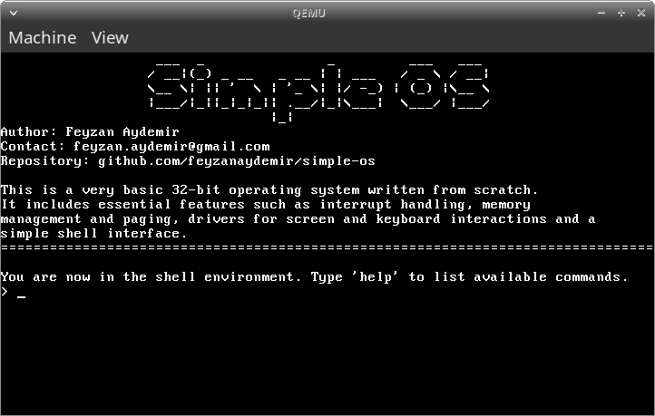

# Simple OS

<!-- <p align="center"></p> -->

## Overview

Simple OS is a minimal operating system kernel developed for the i386 (x86) architecture. It was created as a hobby to learn about OS programming.

### **Features**
  - Custom bootloader
  - 32-bit protected mode
  - Interrupt handling
  - Memory management
  - Screen and keyboard drivers
  - Basic shell

<br/>
<p align="center"></p>

## Installation

You will need a cross-compiler for the i386 architecture and QEMU for emulation.

Clone the repository:
```bash
git clone https://github.com/feyzanaydemir/simple-os.git
```

Compile the kernel and generate the OS image:
```bash
make
```

Run the OS using QEMU:
```bash
make run
```

## License

This project is licensed under the MIT License, see the [LICENSE](LICENSE) file for details.